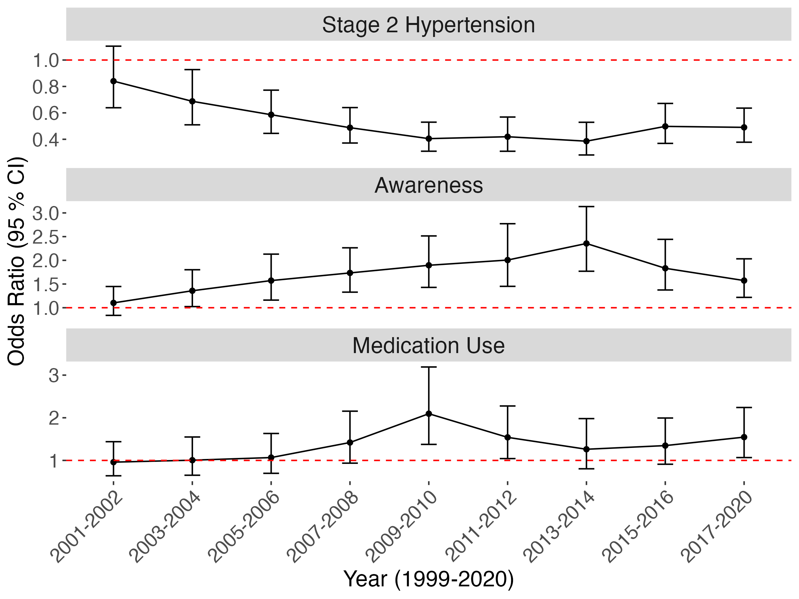
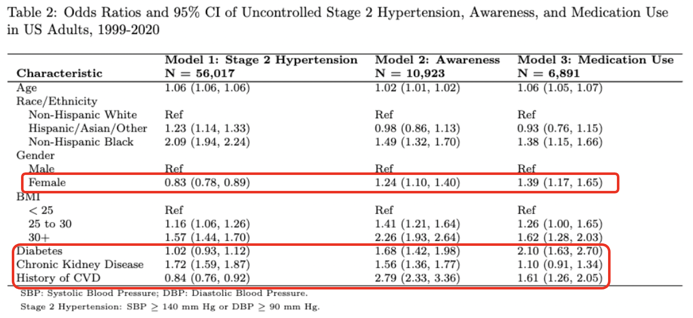

```{r setup, include=FALSE}
knitr::opts_chunk$set(echo = FALSE)
```

## Introduction: Background


**Background**

- Hypertension is a leading risk factor for cardiovascular diseases, affecting public health worldwide and prominently in the U.S. 

**Problem**

- Following an initial improvement in blood pressure control among U.S. adults with hypertension from 1999-2000 to 2007-2008, there was a stagnation and subsequent decrease post-2013 (Muntner P, et al., 2020).

## Introduction

**Motivation** 

- This study aims to explore the reasons behind recent declines in hypertension control.

**Study Objective**

- Examining the trends, awareness, and medication use in stage 2 hypertension among U.S. adults in 1999-2020.

- Assessing the impact of demographic factors and comorbid conditions on hypertension control.

- This study used 1999-2020 National Health and Nutrition Examination Survey (NHANES) data.

<!-- ## -->

<!-- `r kableExtra::text_spec("Methodology", color = "gray", bold = TRUE, font_size = 18)` -->

## Statistical Analysis

1. Weighting and multiple year adjustment

2. Multiple Imputation to address missing data 

3. Logistic Regression Models accounts for complex survey design (Heeringa, S., West, B.T. and Berglund, P.A., 2017):

The model can be expressed as:

$$
log(\frac{\pi}{1-\pi})=X\beta = \beta_0+\beta_1X_1+...+\beta_nX_n
$$

- Variance is estimated using the linearization method

- Using Rubin's multiple imputation combining rule to combine both between and within imputation variance (Rubin, 2018)

<!-- ## -->

<!-- `r kableExtra::text_spec("Results", color = "gray", bold = TRUE, font_size = 18)` -->

## Results
- \textcolor{red}{Gap in high blood pressure treatment!}
  - **Prevalence**: 19% of the population have stage 2 hypertension.
  - **Awareness**: Only 63% of those with stage 2 hypertension are aware of their condition.
  - **Treatment**: Among those aware, 77% are receiving medication
- Less than half ($0.63\times 0.77\approx 49\%$) of those with stage 2 hypertension are being medicated.

## Results

```{r,echo=FALSE,out.width='80%',out.height='80%',fig.align='center'}
knitr::include_graphics("./result_files/table1_v2.png")
```

## Results

```{r,echo=FALSE,out.width='70%',out.height='70%',fig.align='center', fig.cap="Odds Ratios and 95% CI of Uncontrolled Stage 2 Hypertension, Awareness, and Self-reported Antihypertensive Medication Use in US Adults by Year"}

```


## Results

```{r,echo=FALSE,out.width='100%',out.height='70%',fig.align='center'}

```

<!-- ## -->

<!-- `r kableExtra::text_spec("Discussion", color = "gray", bold = TRUE, font_size = 18)` -->

## Discussion
**Findings**

- A gap in high blood pressure treatment
- Overall increase in awareness since 1999, but a notable decline in recent years.
- Level of medication use has not shown significant improvement. 
- Women and people with existing health issues tend to pay more attention to blood pressure management.

**Limitations**

- Potential inaccuracies in self-reported data and the exclusion of certain variables that might influence the outcomes.

## References

\scriptsize
1. Centers for Disease Control and Prevention. Facts about Hypertension. 
URL http://www.cdc.gov/bloodpressure/facts.htm/ [Accessed 22 Dec. 2023.]

2. Centers for Disease Control and Prevention. NHANES tutorials - Variance Estimation module. 
URL https://wwwn.cdc.gov/nchs/nhanes/tutorials/VarianceEstimation.aspx [Accessed 22 Dec. 2023.]

3. Centers for Disease Control and Prevention. NHANES tutorials - weighting module. 
URL https://wwwn.cdc.gov/nchs/nhanes/tutorials/Weighting.aspx [Accessed 22 Dec. 2023.]

4. Heeringa, S., West, B.T. and Berglund, P.A. (2017) Applied Survey Data Analysis. Boca Raton, FL: CRC Press, Taylor & Francis Group. 

5. Muntner P, et al. (2020) Trends in Blood Pressure Control Among US Adults With Hypertension, 1999-2000 to 2017-2018. JAMA 324(12):1190–1200. https://doi.org/10.1001/jama.2020.14545

6. Rubin, D.B. (2018). Flexible Imputation of Missing Data, Second Edition. Chapman and Hall/CRC.

## Q&A

\begin{center}
\Huge Thank you!
\end{center}
\
\begin{center}

\normalsize We would like to express our gratitude to ENAR DataFest for giving us this opportunity!

\normalsize For more information, feel free to email us at 

\normalsize Yiying Wu, email: yw3996@cumc.columbia.edu

\normalsize Yi Huang, email: yh3554@cumc.columbia.edu
\end{center}
