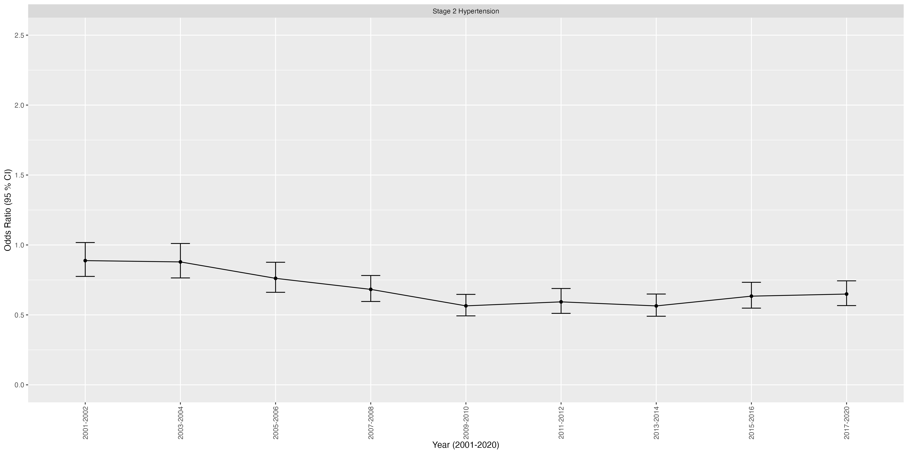
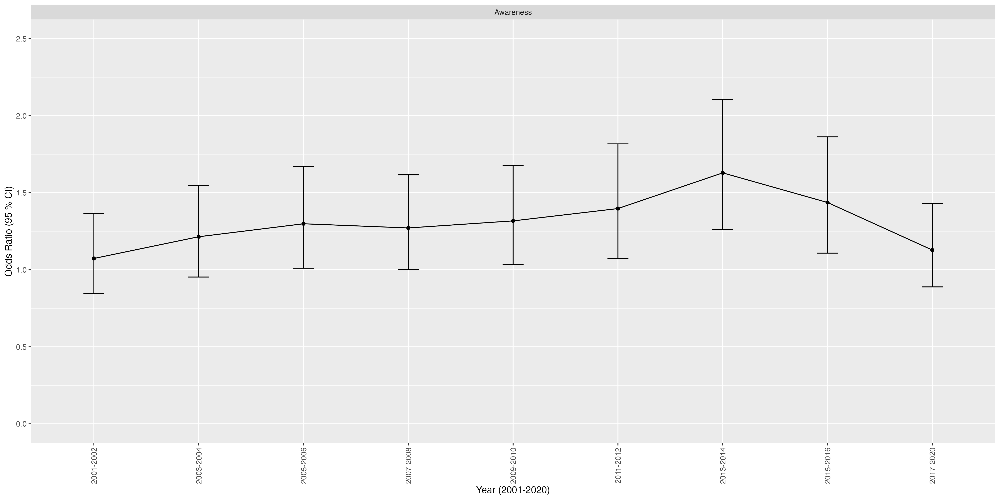
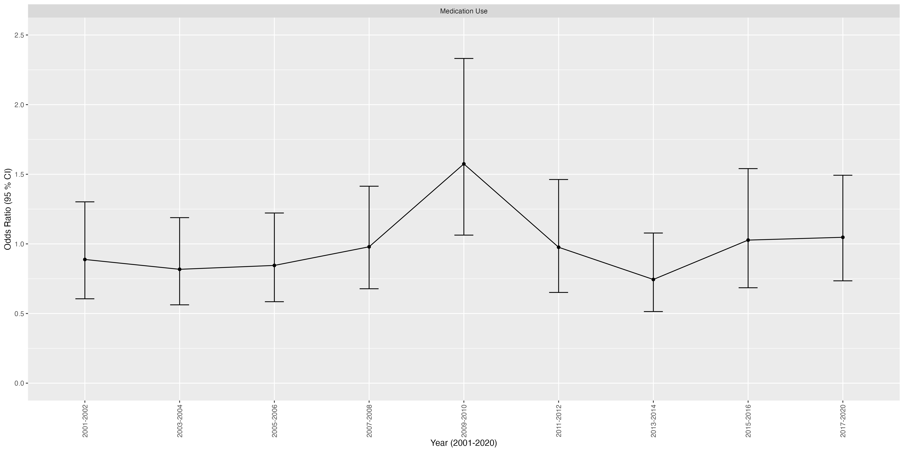

```{r setup, include=FALSE}
knitr::opts_chunk$set(echo = FALSE)
```

## Content

1.  Introduction

2.  Methodology

3.  Results

4.  Discussion

5.  References

## Introduction: Background


**Background**

- Hypertension is a leading risk factor for cardiovascular diseases, affecting public health worldwide and prominently in the U.S. 

**Problem**

- Following an initial improvement in blood pressure control among U.S. adults with hypertension from 1999-2000 to 2007-2008, there was a stagnation and subsequent decrease post-2013 (Muntner P, et al., 2020).

## Introduction

**Motivation** 

- This study is motivated by the need to investigate the reasons behind this decline and to identify factors contributing to the diminishing control of hypertension in recent years.

**Study Objective**

- Examining the trends, awareness, and medication use in stage 2 hypertension among U.S. adults. 

- Assessing the impact of demographic factors and comorbid conditions on hypertension control.

##

`r kableExtra::text_spec("Methodology", color = "gray", bold = TRUE, font_size = 18)`

## Methodology

1. Weighting and multiple year adjustment

2. Multiple Imputation to address missing data

3. Logistic Regression Models (Dobson, 2008):

Suppose there are $n$ covariates $X_i, i=1,\ ...\ n$, the model can be expressed as:

$$
log(\frac{\pi}{1-\pi})=X\beta = \beta_0+\beta_1X_1+...+\beta_nX_n
$$

- $\pi$ is the risk

- $\frac{\pi}{1-\pi}$ is the odds

- $\beta_0$ is the log odds for $X_i's=0$

- $\beta_i$ is the log odds ratio per unit change of $X_i$, holding all other covariates fixed

##

`r kableExtra::text_spec("Results", color = "gray", bold = TRUE, font_size = 18)`

## Results

```{r,echo=FALSE,out.width='90%',out.height='70%',fig.align='center', fig.cap="OR (95% CI) of Stage 2 Hypertension"}

```

## Results

```{r,echo=FALSE,out.width='90%',out.height='70%',fig.align='center', fig.cap="OR (95% CI) of Awareness"}

```

## Results

```{r,echo=FALSE,out.width='90%',out.height='70%',fig.align='center', fig.cap="OR (95% CI) of Self-reported Antihypertensive Medication Use"}

```

##

`r kableExtra::text_spec("Discussion", color = "gray", bold = TRUE, font_size = 18)`

## Discussion


## References

1. Dobson, A.J. (2008) An introduction to generalized linear models, Third Edition. Chapman & Hall. 

2. “Facts about Hypertension.” Centers for Disease Control and Prevention, 6 July 2023. URL http://www.cdc.gov/bloodpressure/facts.htm/ [Accessed 22 Dec. 2023.]

3. Muntner P, et al. (2020) Trends in Blood Pressure Control Among US Adults With Hypertension, 1999-2000 to 2017-2018. JAMA 324(12):1190–1200. https://doi.org/10.1001/jama.2020.14545

4. “Nhanes tutorials - Variance Estimation module”. Centers for Disease Control and Prevention, URL https://wwwn.cdc.gov/nchs/nhanes/tutorials/VarianceEstimation.aspx [Accessed 22 Dec. 2023.]

## References

5. “Nhanes tutorials - weighting module”. Centers for Disease Control and Prevention, URL https://wwwn.cdc.gov/nchs/nhanes/tutorials/Weighting.aspx [Accessed 22 Dec. 2023.]

6. Rubin, D.B. (2018). Flexible Imputation of Missing Data, Second Edition. Chapman and Hall/CRC.
