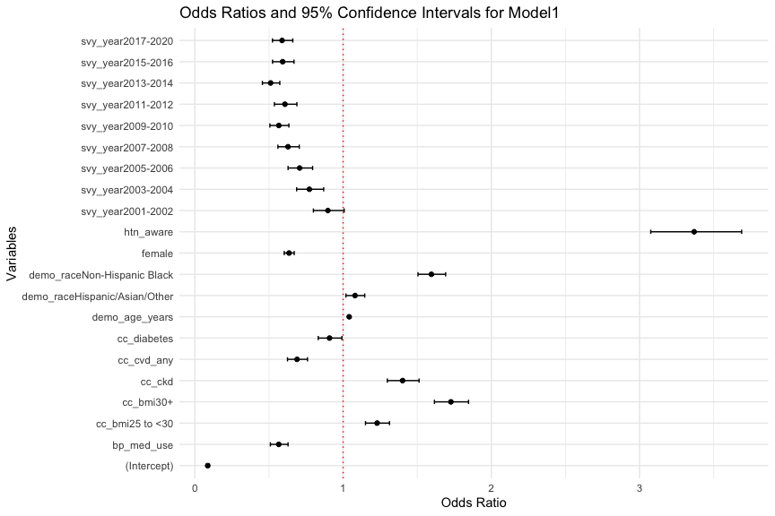
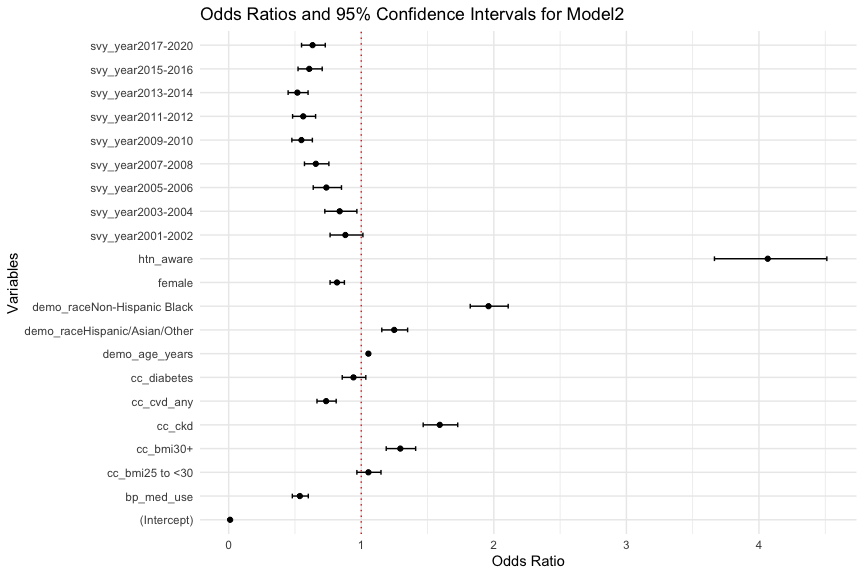

result
================

## This document shows the result of the code

## CardioStatsUSA

To install CardioStatsUSA, run this

``` r
install.packages("CardioStatsUSA")
```

if not work, try this

``` r
if (!requireNamespace("remotes", quietly = TRUE))
install.packages("remotes")
remotes::install_github("jhs-hwg/CardioStatsUSA")
```

## R packages

``` r
knitr::opts_chunk$set(echo = FALSE, message = FALSE, warning = FALSE)
# INSTALL PACKAGES
packages <- c("tidyverse", "dplyr", "knitr", "kableExtra", "cardioStatsUSA", 
              "survey", "gtsummary", "mice", "stargazer", "texreg", "jtools")

# Install missing packages
installed_packages <- packages %in% rownames(installed.packages())
if (any(installed_packages == FALSE)) {
  install.packages(packages[!installed_packages], dependencies = TRUE)
}

# Load packages invisibly
invisible(lapply(packages, library, character.only = TRUE))

# # Remove variables associated with package installation
# rm(packages, installed_packages)
```

## data

## data cleaning

**combine categories**

### recode categorical data

### select the relavent variables

**check variables**

<div id="qfnfbnrtya" style="padding-left:0px;padding-right:0px;padding-top:10px;padding-bottom:10px;overflow-x:auto;overflow-y:auto;width:auto;height:auto;">
<style>#qfnfbnrtya table {
  font-family: system-ui, 'Segoe UI', Roboto, Helvetica, Arial, sans-serif, 'Apple Color Emoji', 'Segoe UI Emoji', 'Segoe UI Symbol', 'Noto Color Emoji';
  -webkit-font-smoothing: antialiased;
  -moz-osx-font-smoothing: grayscale;
}

#qfnfbnrtya thead, #qfnfbnrtya tbody, #qfnfbnrtya tfoot, #qfnfbnrtya tr, #qfnfbnrtya td, #qfnfbnrtya th {
  border-style: none;
}

#qfnfbnrtya p {
  margin: 0;
  padding: 0;
}

#qfnfbnrtya .gt_table {
  display: table;
  border-collapse: collapse;
  line-height: normal;
  margin-left: auto;
  margin-right: auto;
  color: #333333;
  font-size: 16px;
  font-weight: normal;
  font-style: normal;
  background-color: #FFFFFF;
  width: auto;
  border-top-style: solid;
  border-top-width: 2px;
  border-top-color: #A8A8A8;
  border-right-style: none;
  border-right-width: 2px;
  border-right-color: #D3D3D3;
  border-bottom-style: solid;
  border-bottom-width: 2px;
  border-bottom-color: #A8A8A8;
  border-left-style: none;
  border-left-width: 2px;
  border-left-color: #D3D3D3;
}

#qfnfbnrtya .gt_caption {
  padding-top: 4px;
  padding-bottom: 4px;
}

#qfnfbnrtya .gt_title {
  color: #333333;
  font-size: 125%;
  font-weight: initial;
  padding-top: 4px;
  padding-bottom: 4px;
  padding-left: 5px;
  padding-right: 5px;
  border-bottom-color: #FFFFFF;
  border-bottom-width: 0;
}

#qfnfbnrtya .gt_subtitle {
  color: #333333;
  font-size: 85%;
  font-weight: initial;
  padding-top: 3px;
  padding-bottom: 5px;
  padding-left: 5px;
  padding-right: 5px;
  border-top-color: #FFFFFF;
  border-top-width: 0;
}

#qfnfbnrtya .gt_heading {
  background-color: #FFFFFF;
  text-align: center;
  border-bottom-color: #FFFFFF;
  border-left-style: none;
  border-left-width: 1px;
  border-left-color: #D3D3D3;
  border-right-style: none;
  border-right-width: 1px;
  border-right-color: #D3D3D3;
}

#qfnfbnrtya .gt_bottom_border {
  border-bottom-style: solid;
  border-bottom-width: 2px;
  border-bottom-color: #D3D3D3;
}

#qfnfbnrtya .gt_col_headings {
  border-top-style: solid;
  border-top-width: 2px;
  border-top-color: #D3D3D3;
  border-bottom-style: solid;
  border-bottom-width: 2px;
  border-bottom-color: #D3D3D3;
  border-left-style: none;
  border-left-width: 1px;
  border-left-color: #D3D3D3;
  border-right-style: none;
  border-right-width: 1px;
  border-right-color: #D3D3D3;
}

#qfnfbnrtya .gt_col_heading {
  color: #333333;
  background-color: #FFFFFF;
  font-size: 100%;
  font-weight: normal;
  text-transform: inherit;
  border-left-style: none;
  border-left-width: 1px;
  border-left-color: #D3D3D3;
  border-right-style: none;
  border-right-width: 1px;
  border-right-color: #D3D3D3;
  vertical-align: bottom;
  padding-top: 5px;
  padding-bottom: 6px;
  padding-left: 5px;
  padding-right: 5px;
  overflow-x: hidden;
}

#qfnfbnrtya .gt_column_spanner_outer {
  color: #333333;
  background-color: #FFFFFF;
  font-size: 100%;
  font-weight: normal;
  text-transform: inherit;
  padding-top: 0;
  padding-bottom: 0;
  padding-left: 4px;
  padding-right: 4px;
}

#qfnfbnrtya .gt_column_spanner_outer:first-child {
  padding-left: 0;
}

#qfnfbnrtya .gt_column_spanner_outer:last-child {
  padding-right: 0;
}

#qfnfbnrtya .gt_column_spanner {
  border-bottom-style: solid;
  border-bottom-width: 2px;
  border-bottom-color: #D3D3D3;
  vertical-align: bottom;
  padding-top: 5px;
  padding-bottom: 5px;
  overflow-x: hidden;
  display: inline-block;
  width: 100%;
}

#qfnfbnrtya .gt_spanner_row {
  border-bottom-style: hidden;
}

#qfnfbnrtya .gt_group_heading {
  padding-top: 8px;
  padding-bottom: 8px;
  padding-left: 5px;
  padding-right: 5px;
  color: #333333;
  background-color: #FFFFFF;
  font-size: 100%;
  font-weight: initial;
  text-transform: inherit;
  border-top-style: solid;
  border-top-width: 2px;
  border-top-color: #D3D3D3;
  border-bottom-style: solid;
  border-bottom-width: 2px;
  border-bottom-color: #D3D3D3;
  border-left-style: none;
  border-left-width: 1px;
  border-left-color: #D3D3D3;
  border-right-style: none;
  border-right-width: 1px;
  border-right-color: #D3D3D3;
  vertical-align: middle;
  text-align: left;
}

#qfnfbnrtya .gt_empty_group_heading {
  padding: 0.5px;
  color: #333333;
  background-color: #FFFFFF;
  font-size: 100%;
  font-weight: initial;
  border-top-style: solid;
  border-top-width: 2px;
  border-top-color: #D3D3D3;
  border-bottom-style: solid;
  border-bottom-width: 2px;
  border-bottom-color: #D3D3D3;
  vertical-align: middle;
}

#qfnfbnrtya .gt_from_md > :first-child {
  margin-top: 0;
}

#qfnfbnrtya .gt_from_md > :last-child {
  margin-bottom: 0;
}

#qfnfbnrtya .gt_row {
  padding-top: 8px;
  padding-bottom: 8px;
  padding-left: 5px;
  padding-right: 5px;
  margin: 10px;
  border-top-style: solid;
  border-top-width: 1px;
  border-top-color: #D3D3D3;
  border-left-style: none;
  border-left-width: 1px;
  border-left-color: #D3D3D3;
  border-right-style: none;
  border-right-width: 1px;
  border-right-color: #D3D3D3;
  vertical-align: middle;
  overflow-x: hidden;
}

#qfnfbnrtya .gt_stub {
  color: #333333;
  background-color: #FFFFFF;
  font-size: 100%;
  font-weight: initial;
  text-transform: inherit;
  border-right-style: solid;
  border-right-width: 2px;
  border-right-color: #D3D3D3;
  padding-left: 5px;
  padding-right: 5px;
}

#qfnfbnrtya .gt_stub_row_group {
  color: #333333;
  background-color: #FFFFFF;
  font-size: 100%;
  font-weight: initial;
  text-transform: inherit;
  border-right-style: solid;
  border-right-width: 2px;
  border-right-color: #D3D3D3;
  padding-left: 5px;
  padding-right: 5px;
  vertical-align: top;
}

#qfnfbnrtya .gt_row_group_first td {
  border-top-width: 2px;
}

#qfnfbnrtya .gt_row_group_first th {
  border-top-width: 2px;
}

#qfnfbnrtya .gt_summary_row {
  color: #333333;
  background-color: #FFFFFF;
  text-transform: inherit;
  padding-top: 8px;
  padding-bottom: 8px;
  padding-left: 5px;
  padding-right: 5px;
}

#qfnfbnrtya .gt_first_summary_row {
  border-top-style: solid;
  border-top-color: #D3D3D3;
}

#qfnfbnrtya .gt_first_summary_row.thick {
  border-top-width: 2px;
}

#qfnfbnrtya .gt_last_summary_row {
  padding-top: 8px;
  padding-bottom: 8px;
  padding-left: 5px;
  padding-right: 5px;
  border-bottom-style: solid;
  border-bottom-width: 2px;
  border-bottom-color: #D3D3D3;
}

#qfnfbnrtya .gt_grand_summary_row {
  color: #333333;
  background-color: #FFFFFF;
  text-transform: inherit;
  padding-top: 8px;
  padding-bottom: 8px;
  padding-left: 5px;
  padding-right: 5px;
}

#qfnfbnrtya .gt_first_grand_summary_row {
  padding-top: 8px;
  padding-bottom: 8px;
  padding-left: 5px;
  padding-right: 5px;
  border-top-style: double;
  border-top-width: 6px;
  border-top-color: #D3D3D3;
}

#qfnfbnrtya .gt_last_grand_summary_row_top {
  padding-top: 8px;
  padding-bottom: 8px;
  padding-left: 5px;
  padding-right: 5px;
  border-bottom-style: double;
  border-bottom-width: 6px;
  border-bottom-color: #D3D3D3;
}

#qfnfbnrtya .gt_striped {
  background-color: rgba(128, 128, 128, 0.05);
}

#qfnfbnrtya .gt_table_body {
  border-top-style: solid;
  border-top-width: 2px;
  border-top-color: #D3D3D3;
  border-bottom-style: solid;
  border-bottom-width: 2px;
  border-bottom-color: #D3D3D3;
}

#qfnfbnrtya .gt_footnotes {
  color: #333333;
  background-color: #FFFFFF;
  border-bottom-style: none;
  border-bottom-width: 2px;
  border-bottom-color: #D3D3D3;
  border-left-style: none;
  border-left-width: 2px;
  border-left-color: #D3D3D3;
  border-right-style: none;
  border-right-width: 2px;
  border-right-color: #D3D3D3;
}

#qfnfbnrtya .gt_footnote {
  margin: 0px;
  font-size: 90%;
  padding-top: 4px;
  padding-bottom: 4px;
  padding-left: 5px;
  padding-right: 5px;
}

#qfnfbnrtya .gt_sourcenotes {
  color: #333333;
  background-color: #FFFFFF;
  border-bottom-style: none;
  border-bottom-width: 2px;
  border-bottom-color: #D3D3D3;
  border-left-style: none;
  border-left-width: 2px;
  border-left-color: #D3D3D3;
  border-right-style: none;
  border-right-width: 2px;
  border-right-color: #D3D3D3;
}

#qfnfbnrtya .gt_sourcenote {
  font-size: 90%;
  padding-top: 4px;
  padding-bottom: 4px;
  padding-left: 5px;
  padding-right: 5px;
}

#qfnfbnrtya .gt_left {
  text-align: left;
}

#qfnfbnrtya .gt_center {
  text-align: center;
}

#qfnfbnrtya .gt_right {
  text-align: right;
  font-variant-numeric: tabular-nums;
}

#qfnfbnrtya .gt_font_normal {
  font-weight: normal;
}

#qfnfbnrtya .gt_font_bold {
  font-weight: bold;
}

#qfnfbnrtya .gt_font_italic {
  font-style: italic;
}

#qfnfbnrtya .gt_super {
  font-size: 65%;
}

#qfnfbnrtya .gt_footnote_marks {
  font-size: 75%;
  vertical-align: 0.4em;
  position: initial;
}

#qfnfbnrtya .gt_asterisk {
  font-size: 100%;
  vertical-align: 0;
}

#qfnfbnrtya .gt_indent_1 {
  text-indent: 5px;
}

#qfnfbnrtya .gt_indent_2 {
  text-indent: 10px;
}

#qfnfbnrtya .gt_indent_3 {
  text-indent: 15px;
}

#qfnfbnrtya .gt_indent_4 {
  text-indent: 20px;
}

#qfnfbnrtya .gt_indent_5 {
  text-indent: 25px;
}
</style>
<table class="gt_table" data-quarto-disable-processing="false" data-quarto-bootstrap="false">
  <thead>
    
    <tr class="gt_col_headings">
      <th class="gt_col_heading gt_columns_bottom_border gt_left" rowspan="1" colspan="1" scope="col" id="&lt;strong&gt;Characteristic&lt;/strong&gt;"><strong>Characteristic</strong></th>
      <th class="gt_col_heading gt_columns_bottom_border gt_center" rowspan="1" colspan="1" scope="col" id="&lt;strong&gt;N = 59,799&lt;/strong&gt;&lt;span class=&quot;gt_footnote_marks&quot; style=&quot;white-space:nowrap;font-style:italic;font-weight:normal;&quot;&gt;&lt;sup&gt;1&lt;/sup&gt;&lt;/span&gt;"><strong>N = 59,799</strong><span class="gt_footnote_marks" style="white-space:nowrap;font-style:italic;font-weight:normal;"><sup>1</sup></span></th>
    </tr>
  </thead>
  <tbody class="gt_table_body">
    <tr><td headers="label" class="gt_row gt_left" style="font-weight: bold;">Respondent sequence number</td>
<td headers="stat_0" class="gt_row gt_center">56,171 (29,381, 83,307)</td></tr>
    <tr><td headers="label" class="gt_row gt_left" style="font-weight: bold;">Masked Variance Pseudo-PSU</td>
<td headers="stat_0" class="gt_row gt_center"><br /></td></tr>
    <tr><td headers="label" class="gt_row gt_left">    1</td>
<td headers="stat_0" class="gt_row gt_center">29,272 (49%)</td></tr>
    <tr><td headers="label" class="gt_row gt_left">    2</td>
<td headers="stat_0" class="gt_row gt_center">29,516 (49%)</td></tr>
    <tr><td headers="label" class="gt_row gt_left">    3</td>
<td headers="stat_0" class="gt_row gt_center">1,011 (1.7%)</td></tr>
    <tr><td headers="label" class="gt_row gt_left" style="font-weight: bold;">Masked Variance Pseudo-Stratum</td>
<td headers="stat_0" class="gt_row gt_center">80 (40, 118)</td></tr>
    <tr><td headers="label" class="gt_row gt_left" style="font-weight: bold;">Full Sample 2 Year MEC Exam Weight</td>
<td headers="stat_0" class="gt_row gt_center">25,473 (14,775, 50,242)</td></tr>
    <tr><td headers="label" class="gt_row gt_left" style="font-weight: bold;">Subpopulation for hypertension</td>
<td headers="stat_0" class="gt_row gt_center">56,017 (94%)</td></tr>
    <tr><td headers="label" class="gt_row gt_left" style="font-weight: bold;">NHANES cycle</td>
<td headers="stat_0" class="gt_row gt_center"><br /></td></tr>
    <tr><td headers="label" class="gt_row gt_left">    1999-2000</td>
<td headers="stat_0" class="gt_row gt_center">4,976 (8.3%)</td></tr>
    <tr><td headers="label" class="gt_row gt_left">    2001-2002</td>
<td headers="stat_0" class="gt_row gt_center">5,592 (9.4%)</td></tr>
    <tr><td headers="label" class="gt_row gt_left">    2003-2004</td>
<td headers="stat_0" class="gt_row gt_center">5,303 (8.9%)</td></tr>
    <tr><td headers="label" class="gt_row gt_left">    2005-2006</td>
<td headers="stat_0" class="gt_row gt_center">5,334 (8.9%)</td></tr>
    <tr><td headers="label" class="gt_row gt_left">    2007-2008</td>
<td headers="stat_0" class="gt_row gt_center">5,995 (10%)</td></tr>
    <tr><td headers="label" class="gt_row gt_left">    2009-2010</td>
<td headers="stat_0" class="gt_row gt_center">6,360 (11%)</td></tr>
    <tr><td headers="label" class="gt_row gt_left">    2011-2012</td>
<td headers="stat_0" class="gt_row gt_center">5,615 (9.4%)</td></tr>
    <tr><td headers="label" class="gt_row gt_left">    2013-2014</td>
<td headers="stat_0" class="gt_row gt_center">5,924 (9.9%)</td></tr>
    <tr><td headers="label" class="gt_row gt_left">    2015-2016</td>
<td headers="stat_0" class="gt_row gt_center">5,735 (9.6%)</td></tr>
    <tr><td headers="label" class="gt_row gt_left">    2017-2020</td>
<td headers="stat_0" class="gt_row gt_center">8,965 (15%)</td></tr>
    <tr><td headers="label" class="gt_row gt_left" style="font-weight: bold;">demo_age_cat</td>
<td headers="stat_0" class="gt_row gt_center"><br /></td></tr>
    <tr><td headers="label" class="gt_row gt_left">    18 to 44</td>
<td headers="stat_0" class="gt_row gt_center">27,935 (47%)</td></tr>
    <tr><td headers="label" class="gt_row gt_left">    45 to 64</td>
<td headers="stat_0" class="gt_row gt_center">18,082 (30%)</td></tr>
    <tr><td headers="label" class="gt_row gt_left">    65+</td>
<td headers="stat_0" class="gt_row gt_center">13,782 (23%)</td></tr>
    <tr><td headers="label" class="gt_row gt_left" style="font-weight: bold;">Age at Screening Adjudicated - Recode</td>
<td headers="stat_0" class="gt_row gt_center">47 (31, 63)</td></tr>
    <tr><td headers="label" class="gt_row gt_left" style="font-weight: bold;">demo_race</td>
<td headers="stat_0" class="gt_row gt_center"><br /></td></tr>
    <tr><td headers="label" class="gt_row gt_left">    Non-Hispanic White</td>
<td headers="stat_0" class="gt_row gt_center">25,254 (42%)</td></tr>
    <tr><td headers="label" class="gt_row gt_left">    Hispanic/Asian/Other</td>
<td headers="stat_0" class="gt_row gt_center">21,262 (36%)</td></tr>
    <tr><td headers="label" class="gt_row gt_left">    Non-Hispanic Black</td>
<td headers="stat_0" class="gt_row gt_center">13,283 (22%)</td></tr>
    <tr><td headers="label" class="gt_row gt_left" style="font-weight: bold;">pregnant</td>
<td headers="stat_0" class="gt_row gt_center">1,620 (2.7%)</td></tr>
    <tr><td headers="label" class="gt_row gt_left">    Unknown</td>
<td headers="stat_0" class="gt_row gt_center">671</td></tr>
    <tr><td headers="label" class="gt_row gt_left" style="font-weight: bold;">female</td>
<td headers="stat_0" class="gt_row gt_center">30,917 (52%)</td></tr>
    <tr><td headers="label" class="gt_row gt_left" style="font-weight: bold;">bp_uncontrolled_140_90</td>
<td headers="stat_0" class="gt_row gt_center">11,082 (19%)</td></tr>
    <tr><td headers="label" class="gt_row gt_left" style="font-weight: bold;">bp_uncontrolled_130_80</td>
<td headers="stat_0" class="gt_row gt_center">22,028 (37%)</td></tr>
    <tr><td headers="label" class="gt_row gt_left" style="font-weight: bold;">htn_accaha</td>
<td headers="stat_0" class="gt_row gt_center">28,056 (47%)</td></tr>
    <tr><td headers="label" class="gt_row gt_left" style="font-weight: bold;">htn_aware</td>
<td headers="stat_0" class="gt_row gt_center">19,647 (33%)</td></tr>
    <tr><td headers="label" class="gt_row gt_left">    Unknown</td>
<td headers="stat_0" class="gt_row gt_center">268</td></tr>
    <tr><td headers="label" class="gt_row gt_left" style="font-weight: bold;">htn_resistant_accaha</td>
<td headers="stat_0" class="gt_row gt_center">2,723 (4.6%)</td></tr>
    <tr><td headers="label" class="gt_row gt_left" style="font-weight: bold;">htn_resistant_accaha_thz</td>
<td headers="stat_0" class="gt_row gt_center">1,580 (2.6%)</td></tr>
    <tr><td headers="label" class="gt_row gt_left" style="font-weight: bold;">bp_med_use</td>
<td headers="stat_0" class="gt_row gt_center">14,690 (25%)</td></tr>
    <tr><td headers="label" class="gt_row gt_left">    Unknown</td>
<td headers="stat_0" class="gt_row gt_center">292</td></tr>
    <tr><td headers="label" class="gt_row gt_left" style="font-weight: bold;">bp_med_recommended_accaha</td>
<td headers="stat_0" class="gt_row gt_center">23,082 (39%)</td></tr>
    <tr><td headers="label" class="gt_row gt_left" style="font-weight: bold;">bp_med_n_class</td>
<td headers="stat_0" class="gt_row gt_center"><br /></td></tr>
    <tr><td headers="label" class="gt_row gt_left">    None</td>
<td headers="stat_0" class="gt_row gt_center">42,088 (71%)</td></tr>
    <tr><td headers="label" class="gt_row gt_left">    One</td>
<td headers="stat_0" class="gt_row gt_center">7,347 (12%)</td></tr>
    <tr><td headers="label" class="gt_row gt_left">    Two or more</td>
<td headers="stat_0" class="gt_row gt_center">9,883 (17%)</td></tr>
    <tr><td headers="label" class="gt_row gt_left">    Unknown</td>
<td headers="stat_0" class="gt_row gt_center">481</td></tr>
    <tr><td headers="label" class="gt_row gt_left" style="font-weight: bold;">bp_med_n_pills</td>
<td headers="stat_0" class="gt_row gt_center"><br /></td></tr>
    <tr><td headers="label" class="gt_row gt_left">    None</td>
<td headers="stat_0" class="gt_row gt_center">42,088 (71%)</td></tr>
    <tr><td headers="label" class="gt_row gt_left">    One</td>
<td headers="stat_0" class="gt_row gt_center">8,995 (15%)</td></tr>
    <tr><td headers="label" class="gt_row gt_left">    Two or more</td>
<td headers="stat_0" class="gt_row gt_center">8,235 (14%)</td></tr>
    <tr><td headers="label" class="gt_row gt_left">    Unknown</td>
<td headers="stat_0" class="gt_row gt_center">481</td></tr>
    <tr><td headers="label" class="gt_row gt_left" style="font-weight: bold;">bp_med_combination</td>
<td headers="stat_0" class="gt_row gt_center">3,256 (5.5%)</td></tr>
    <tr><td headers="label" class="gt_row gt_left">    Unknown</td>
<td headers="stat_0" class="gt_row gt_center">481</td></tr>
    <tr><td headers="label" class="gt_row gt_left" style="font-weight: bold;">bp_med_pills_gteq_2</td>
<td headers="stat_0" class="gt_row gt_center">8,235 (14%)</td></tr>
    <tr><td headers="label" class="gt_row gt_left" style="font-weight: bold;">bp_med_ace</td>
<td headers="stat_0" class="gt_row gt_center">7,061 (12%)</td></tr>
    <tr><td headers="label" class="gt_row gt_left">    Unknown</td>
<td headers="stat_0" class="gt_row gt_center">481</td></tr>
    <tr><td headers="label" class="gt_row gt_left" style="font-weight: bold;">bp_med_aldo</td>
<td headers="stat_0" class="gt_row gt_center">439 (0.7%)</td></tr>
    <tr><td headers="label" class="gt_row gt_left">    Unknown</td>
<td headers="stat_0" class="gt_row gt_center">481</td></tr>
    <tr><td headers="label" class="gt_row gt_left" style="font-weight: bold;">bp_med_alpha</td>
<td headers="stat_0" class="gt_row gt_center">809 (1.4%)</td></tr>
    <tr><td headers="label" class="gt_row gt_left">    Unknown</td>
<td headers="stat_0" class="gt_row gt_center">481</td></tr>
    <tr><td headers="label" class="gt_row gt_left" style="font-weight: bold;">bp_med_angioten</td>
<td headers="stat_0" class="gt_row gt_center">59,318 (100%)</td></tr>
    <tr><td headers="label" class="gt_row gt_left">    Unknown</td>
<td headers="stat_0" class="gt_row gt_center">481</td></tr>
    <tr><td headers="label" class="gt_row gt_left" style="font-weight: bold;">bp_med_beta</td>
<td headers="stat_0" class="gt_row gt_center">6,493 (11%)</td></tr>
    <tr><td headers="label" class="gt_row gt_left">    Unknown</td>
<td headers="stat_0" class="gt_row gt_center">481</td></tr>
    <tr><td headers="label" class="gt_row gt_left" style="font-weight: bold;">bp_med_ccb</td>
<td headers="stat_0" class="gt_row gt_center">5,236 (8.8%)</td></tr>
    <tr><td headers="label" class="gt_row gt_left">    Unknown</td>
<td headers="stat_0" class="gt_row gt_center">481</td></tr>
    <tr><td headers="label" class="gt_row gt_left" style="font-weight: bold;">bp_med_ccb_dh</td>
<td headers="stat_0" class="gt_row gt_center">4,110 (6.9%)</td></tr>
    <tr><td headers="label" class="gt_row gt_left">    Unknown</td>
<td headers="stat_0" class="gt_row gt_center">481</td></tr>
    <tr><td headers="label" class="gt_row gt_left" style="font-weight: bold;">bp_med_ccb_ndh</td>
<td headers="stat_0" class="gt_row gt_center">1,148 (1.9%)</td></tr>
    <tr><td headers="label" class="gt_row gt_left">    Unknown</td>
<td headers="stat_0" class="gt_row gt_center">481</td></tr>
    <tr><td headers="label" class="gt_row gt_left" style="font-weight: bold;">bp_med_central</td>
<td headers="stat_0" class="gt_row gt_center">504 (0.8%)</td></tr>
    <tr><td headers="label" class="gt_row gt_left">    Unknown</td>
<td headers="stat_0" class="gt_row gt_center">481</td></tr>
    <tr><td headers="label" class="gt_row gt_left" style="font-weight: bold;">bp_med_renin_inhibitors</td>
<td headers="stat_0" class="gt_row gt_center">26 (&lt;0.1%)</td></tr>
    <tr><td headers="label" class="gt_row gt_left">    Unknown</td>
<td headers="stat_0" class="gt_row gt_center">481</td></tr>
    <tr><td headers="label" class="gt_row gt_left" style="font-weight: bold;">bp_med_vasod</td>
<td headers="stat_0" class="gt_row gt_center">296 (0.5%)</td></tr>
    <tr><td headers="label" class="gt_row gt_left">    Unknown</td>
<td headers="stat_0" class="gt_row gt_center">481</td></tr>
    <tr><td headers="label" class="gt_row gt_left" style="font-weight: bold;">bp_med_diur_loop</td>
<td headers="stat_0" class="gt_row gt_center">2,042 (3.4%)</td></tr>
    <tr><td headers="label" class="gt_row gt_left">    Unknown</td>
<td headers="stat_0" class="gt_row gt_center">481</td></tr>
    <tr><td headers="label" class="gt_row gt_left" style="font-weight: bold;">bp_med_diur_Ksparing</td>
<td headers="stat_0" class="gt_row gt_center">839 (1.4%)</td></tr>
    <tr><td headers="label" class="gt_row gt_left">    Unknown</td>
<td headers="stat_0" class="gt_row gt_center">481</td></tr>
    <tr><td headers="label" class="gt_row gt_left" style="font-weight: bold;">bp_med_diur_thz</td>
<td headers="stat_0" class="gt_row gt_center">5,311 (9.0%)</td></tr>
    <tr><td headers="label" class="gt_row gt_left">    Unknown</td>
<td headers="stat_0" class="gt_row gt_center">481</td></tr>
    <tr><td headers="label" class="gt_row gt_left" style="font-weight: bold;">cc_smoke</td>
<td headers="stat_0" class="gt_row gt_center"><br /></td></tr>
    <tr><td headers="label" class="gt_row gt_left">    Current</td>
<td headers="stat_0" class="gt_row gt_center">11,615 (21%)</td></tr>
    <tr><td headers="label" class="gt_row gt_left">    Former</td>
<td headers="stat_0" class="gt_row gt_center">13,694 (24%)</td></tr>
    <tr><td headers="label" class="gt_row gt_left">    Never</td>
<td headers="stat_0" class="gt_row gt_center">31,331 (55%)</td></tr>
    <tr><td headers="label" class="gt_row gt_left">    Unknown</td>
<td headers="stat_0" class="gt_row gt_center">3,159</td></tr>
    <tr><td headers="label" class="gt_row gt_left" style="font-weight: bold;">cc_bmi</td>
<td headers="stat_0" class="gt_row gt_center"><br /></td></tr>
    <tr><td headers="label" class="gt_row gt_left">    &lt;25</td>
<td headers="stat_0" class="gt_row gt_center">18,364 (32%)</td></tr>
    <tr><td headers="label" class="gt_row gt_left">    25 to &lt;30</td>
<td headers="stat_0" class="gt_row gt_center">19,086 (33%)</td></tr>
    <tr><td headers="label" class="gt_row gt_left">    30+</td>
<td headers="stat_0" class="gt_row gt_center">20,771 (36%)</td></tr>
    <tr><td headers="label" class="gt_row gt_left">    Unknown</td>
<td headers="stat_0" class="gt_row gt_center">1,578</td></tr>
    <tr><td headers="label" class="gt_row gt_left" style="font-weight: bold;">cc_diabetes</td>
<td headers="stat_0" class="gt_row gt_center">7,782 (13%)</td></tr>
    <tr><td headers="label" class="gt_row gt_left" style="font-weight: bold;">cc_ckd</td>
<td headers="stat_0" class="gt_row gt_center">9,979 (17%)</td></tr>
    <tr><td headers="label" class="gt_row gt_left" style="font-weight: bold;">cc_cvd_mi</td>
<td headers="stat_0" class="gt_row gt_center">2,437 (4.4%)</td></tr>
    <tr><td headers="label" class="gt_row gt_left">    Unknown</td>
<td headers="stat_0" class="gt_row gt_center">4,213</td></tr>
    <tr><td headers="label" class="gt_row gt_left" style="font-weight: bold;">cc_cvd_chd</td>
<td headers="stat_0" class="gt_row gt_center">3,573 (6.4%)</td></tr>
    <tr><td headers="label" class="gt_row gt_left">    Unknown</td>
<td headers="stat_0" class="gt_row gt_center">4,216</td></tr>
    <tr><td headers="label" class="gt_row gt_left" style="font-weight: bold;">cc_cvd_stroke</td>
<td headers="stat_0" class="gt_row gt_center">2,205 (4.0%)</td></tr>
    <tr><td headers="label" class="gt_row gt_left">    Unknown</td>
<td headers="stat_0" class="gt_row gt_center">4,196</td></tr>
    <tr><td headers="label" class="gt_row gt_left" style="font-weight: bold;">cc_cvd_ascvd</td>
<td headers="stat_0" class="gt_row gt_center">5,134 (8.6%)</td></tr>
    <tr><td headers="label" class="gt_row gt_left" style="font-weight: bold;">cc_cvd_hf</td>
<td headers="stat_0" class="gt_row gt_center">1,880 (3.4%)</td></tr>
    <tr><td headers="label" class="gt_row gt_left">    Unknown</td>
<td headers="stat_0" class="gt_row gt_center">4,293</td></tr>
    <tr><td headers="label" class="gt_row gt_left" style="font-weight: bold;">cc_cvd_any</td>
<td headers="stat_0" class="gt_row gt_center">5,823 (9.7%)</td></tr>
  </tbody>
  
  <tfoot class="gt_footnotes">
    <tr>
      <td class="gt_footnote" colspan="2"><span class="gt_footnote_marks" style="white-space:nowrap;font-style:italic;font-weight:normal;"><sup>1</sup></span> Median (IQR); n (%)</td>
    </tr>
  </tfoot>
</table>
</div>

### Create a new data frame that contains 11 predictors

<div id="yowuzijnfs" style="padding-left:0px;padding-right:0px;padding-top:10px;padding-bottom:10px;overflow-x:auto;overflow-y:auto;width:auto;height:auto;">
<style>#yowuzijnfs table {
  font-family: system-ui, 'Segoe UI', Roboto, Helvetica, Arial, sans-serif, 'Apple Color Emoji', 'Segoe UI Emoji', 'Segoe UI Symbol', 'Noto Color Emoji';
  -webkit-font-smoothing: antialiased;
  -moz-osx-font-smoothing: grayscale;
}

#yowuzijnfs thead, #yowuzijnfs tbody, #yowuzijnfs tfoot, #yowuzijnfs tr, #yowuzijnfs td, #yowuzijnfs th {
  border-style: none;
}

#yowuzijnfs p {
  margin: 0;
  padding: 0;
}

#yowuzijnfs .gt_table {
  display: table;
  border-collapse: collapse;
  line-height: normal;
  margin-left: auto;
  margin-right: auto;
  color: #333333;
  font-size: 16px;
  font-weight: normal;
  font-style: normal;
  background-color: #FFFFFF;
  width: auto;
  border-top-style: solid;
  border-top-width: 2px;
  border-top-color: #A8A8A8;
  border-right-style: none;
  border-right-width: 2px;
  border-right-color: #D3D3D3;
  border-bottom-style: solid;
  border-bottom-width: 2px;
  border-bottom-color: #A8A8A8;
  border-left-style: none;
  border-left-width: 2px;
  border-left-color: #D3D3D3;
}

#yowuzijnfs .gt_caption {
  padding-top: 4px;
  padding-bottom: 4px;
}

#yowuzijnfs .gt_title {
  color: #333333;
  font-size: 125%;
  font-weight: initial;
  padding-top: 4px;
  padding-bottom: 4px;
  padding-left: 5px;
  padding-right: 5px;
  border-bottom-color: #FFFFFF;
  border-bottom-width: 0;
}

#yowuzijnfs .gt_subtitle {
  color: #333333;
  font-size: 85%;
  font-weight: initial;
  padding-top: 3px;
  padding-bottom: 5px;
  padding-left: 5px;
  padding-right: 5px;
  border-top-color: #FFFFFF;
  border-top-width: 0;
}

#yowuzijnfs .gt_heading {
  background-color: #FFFFFF;
  text-align: center;
  border-bottom-color: #FFFFFF;
  border-left-style: none;
  border-left-width: 1px;
  border-left-color: #D3D3D3;
  border-right-style: none;
  border-right-width: 1px;
  border-right-color: #D3D3D3;
}

#yowuzijnfs .gt_bottom_border {
  border-bottom-style: solid;
  border-bottom-width: 2px;
  border-bottom-color: #D3D3D3;
}

#yowuzijnfs .gt_col_headings {
  border-top-style: solid;
  border-top-width: 2px;
  border-top-color: #D3D3D3;
  border-bottom-style: solid;
  border-bottom-width: 2px;
  border-bottom-color: #D3D3D3;
  border-left-style: none;
  border-left-width: 1px;
  border-left-color: #D3D3D3;
  border-right-style: none;
  border-right-width: 1px;
  border-right-color: #D3D3D3;
}

#yowuzijnfs .gt_col_heading {
  color: #333333;
  background-color: #FFFFFF;
  font-size: 100%;
  font-weight: normal;
  text-transform: inherit;
  border-left-style: none;
  border-left-width: 1px;
  border-left-color: #D3D3D3;
  border-right-style: none;
  border-right-width: 1px;
  border-right-color: #D3D3D3;
  vertical-align: bottom;
  padding-top: 5px;
  padding-bottom: 6px;
  padding-left: 5px;
  padding-right: 5px;
  overflow-x: hidden;
}

#yowuzijnfs .gt_column_spanner_outer {
  color: #333333;
  background-color: #FFFFFF;
  font-size: 100%;
  font-weight: normal;
  text-transform: inherit;
  padding-top: 0;
  padding-bottom: 0;
  padding-left: 4px;
  padding-right: 4px;
}

#yowuzijnfs .gt_column_spanner_outer:first-child {
  padding-left: 0;
}

#yowuzijnfs .gt_column_spanner_outer:last-child {
  padding-right: 0;
}

#yowuzijnfs .gt_column_spanner {
  border-bottom-style: solid;
  border-bottom-width: 2px;
  border-bottom-color: #D3D3D3;
  vertical-align: bottom;
  padding-top: 5px;
  padding-bottom: 5px;
  overflow-x: hidden;
  display: inline-block;
  width: 100%;
}

#yowuzijnfs .gt_spanner_row {
  border-bottom-style: hidden;
}

#yowuzijnfs .gt_group_heading {
  padding-top: 8px;
  padding-bottom: 8px;
  padding-left: 5px;
  padding-right: 5px;
  color: #333333;
  background-color: #FFFFFF;
  font-size: 100%;
  font-weight: initial;
  text-transform: inherit;
  border-top-style: solid;
  border-top-width: 2px;
  border-top-color: #D3D3D3;
  border-bottom-style: solid;
  border-bottom-width: 2px;
  border-bottom-color: #D3D3D3;
  border-left-style: none;
  border-left-width: 1px;
  border-left-color: #D3D3D3;
  border-right-style: none;
  border-right-width: 1px;
  border-right-color: #D3D3D3;
  vertical-align: middle;
  text-align: left;
}

#yowuzijnfs .gt_empty_group_heading {
  padding: 0.5px;
  color: #333333;
  background-color: #FFFFFF;
  font-size: 100%;
  font-weight: initial;
  border-top-style: solid;
  border-top-width: 2px;
  border-top-color: #D3D3D3;
  border-bottom-style: solid;
  border-bottom-width: 2px;
  border-bottom-color: #D3D3D3;
  vertical-align: middle;
}

#yowuzijnfs .gt_from_md > :first-child {
  margin-top: 0;
}

#yowuzijnfs .gt_from_md > :last-child {
  margin-bottom: 0;
}

#yowuzijnfs .gt_row {
  padding-top: 8px;
  padding-bottom: 8px;
  padding-left: 5px;
  padding-right: 5px;
  margin: 10px;
  border-top-style: solid;
  border-top-width: 1px;
  border-top-color: #D3D3D3;
  border-left-style: none;
  border-left-width: 1px;
  border-left-color: #D3D3D3;
  border-right-style: none;
  border-right-width: 1px;
  border-right-color: #D3D3D3;
  vertical-align: middle;
  overflow-x: hidden;
}

#yowuzijnfs .gt_stub {
  color: #333333;
  background-color: #FFFFFF;
  font-size: 100%;
  font-weight: initial;
  text-transform: inherit;
  border-right-style: solid;
  border-right-width: 2px;
  border-right-color: #D3D3D3;
  padding-left: 5px;
  padding-right: 5px;
}

#yowuzijnfs .gt_stub_row_group {
  color: #333333;
  background-color: #FFFFFF;
  font-size: 100%;
  font-weight: initial;
  text-transform: inherit;
  border-right-style: solid;
  border-right-width: 2px;
  border-right-color: #D3D3D3;
  padding-left: 5px;
  padding-right: 5px;
  vertical-align: top;
}

#yowuzijnfs .gt_row_group_first td {
  border-top-width: 2px;
}

#yowuzijnfs .gt_row_group_first th {
  border-top-width: 2px;
}

#yowuzijnfs .gt_summary_row {
  color: #333333;
  background-color: #FFFFFF;
  text-transform: inherit;
  padding-top: 8px;
  padding-bottom: 8px;
  padding-left: 5px;
  padding-right: 5px;
}

#yowuzijnfs .gt_first_summary_row {
  border-top-style: solid;
  border-top-color: #D3D3D3;
}

#yowuzijnfs .gt_first_summary_row.thick {
  border-top-width: 2px;
}

#yowuzijnfs .gt_last_summary_row {
  padding-top: 8px;
  padding-bottom: 8px;
  padding-left: 5px;
  padding-right: 5px;
  border-bottom-style: solid;
  border-bottom-width: 2px;
  border-bottom-color: #D3D3D3;
}

#yowuzijnfs .gt_grand_summary_row {
  color: #333333;
  background-color: #FFFFFF;
  text-transform: inherit;
  padding-top: 8px;
  padding-bottom: 8px;
  padding-left: 5px;
  padding-right: 5px;
}

#yowuzijnfs .gt_first_grand_summary_row {
  padding-top: 8px;
  padding-bottom: 8px;
  padding-left: 5px;
  padding-right: 5px;
  border-top-style: double;
  border-top-width: 6px;
  border-top-color: #D3D3D3;
}

#yowuzijnfs .gt_last_grand_summary_row_top {
  padding-top: 8px;
  padding-bottom: 8px;
  padding-left: 5px;
  padding-right: 5px;
  border-bottom-style: double;
  border-bottom-width: 6px;
  border-bottom-color: #D3D3D3;
}

#yowuzijnfs .gt_striped {
  background-color: rgba(128, 128, 128, 0.05);
}

#yowuzijnfs .gt_table_body {
  border-top-style: solid;
  border-top-width: 2px;
  border-top-color: #D3D3D3;
  border-bottom-style: solid;
  border-bottom-width: 2px;
  border-bottom-color: #D3D3D3;
}

#yowuzijnfs .gt_footnotes {
  color: #333333;
  background-color: #FFFFFF;
  border-bottom-style: none;
  border-bottom-width: 2px;
  border-bottom-color: #D3D3D3;
  border-left-style: none;
  border-left-width: 2px;
  border-left-color: #D3D3D3;
  border-right-style: none;
  border-right-width: 2px;
  border-right-color: #D3D3D3;
}

#yowuzijnfs .gt_footnote {
  margin: 0px;
  font-size: 90%;
  padding-top: 4px;
  padding-bottom: 4px;
  padding-left: 5px;
  padding-right: 5px;
}

#yowuzijnfs .gt_sourcenotes {
  color: #333333;
  background-color: #FFFFFF;
  border-bottom-style: none;
  border-bottom-width: 2px;
  border-bottom-color: #D3D3D3;
  border-left-style: none;
  border-left-width: 2px;
  border-left-color: #D3D3D3;
  border-right-style: none;
  border-right-width: 2px;
  border-right-color: #D3D3D3;
}

#yowuzijnfs .gt_sourcenote {
  font-size: 90%;
  padding-top: 4px;
  padding-bottom: 4px;
  padding-left: 5px;
  padding-right: 5px;
}

#yowuzijnfs .gt_left {
  text-align: left;
}

#yowuzijnfs .gt_center {
  text-align: center;
}

#yowuzijnfs .gt_right {
  text-align: right;
  font-variant-numeric: tabular-nums;
}

#yowuzijnfs .gt_font_normal {
  font-weight: normal;
}

#yowuzijnfs .gt_font_bold {
  font-weight: bold;
}

#yowuzijnfs .gt_font_italic {
  font-style: italic;
}

#yowuzijnfs .gt_super {
  font-size: 65%;
}

#yowuzijnfs .gt_footnote_marks {
  font-size: 75%;
  vertical-align: 0.4em;
  position: initial;
}

#yowuzijnfs .gt_asterisk {
  font-size: 100%;
  vertical-align: 0;
}

#yowuzijnfs .gt_indent_1 {
  text-indent: 5px;
}

#yowuzijnfs .gt_indent_2 {
  text-indent: 10px;
}

#yowuzijnfs .gt_indent_3 {
  text-indent: 15px;
}

#yowuzijnfs .gt_indent_4 {
  text-indent: 20px;
}

#yowuzijnfs .gt_indent_5 {
  text-indent: 25px;
}
</style>
<table class="gt_table" data-quarto-disable-processing="false" data-quarto-bootstrap="false">
  <thead>
    
    <tr class="gt_col_headings">
      <th class="gt_col_heading gt_columns_bottom_border gt_left" rowspan="1" colspan="1" scope="col" id="&lt;strong&gt;Characteristic&lt;/strong&gt;"><strong>Characteristic</strong></th>
      <th class="gt_col_heading gt_columns_bottom_border gt_center" rowspan="1" colspan="1" scope="col" id="&lt;strong&gt;N = 59,799&lt;/strong&gt;&lt;span class=&quot;gt_footnote_marks&quot; style=&quot;white-space:nowrap;font-style:italic;font-weight:normal;&quot;&gt;&lt;sup&gt;1&lt;/sup&gt;&lt;/span&gt;"><strong>N = 59,799</strong><span class="gt_footnote_marks" style="white-space:nowrap;font-style:italic;font-weight:normal;"><sup>1</sup></span></th>
    </tr>
  </thead>
  <tbody class="gt_table_body">
    <tr><td headers="label" class="gt_row gt_left" style="font-weight: bold;">Respondent sequence number</td>
<td headers="stat_0" class="gt_row gt_center">56,171 (29,381, 83,307)</td></tr>
    <tr><td headers="label" class="gt_row gt_left" style="font-weight: bold;">Full Sample 2 Year MEC Exam Weight</td>
<td headers="stat_0" class="gt_row gt_center">25,473 (14,775, 50,242)</td></tr>
    <tr><td headers="label" class="gt_row gt_left" style="font-weight: bold;">Masked Variance Pseudo-PSU</td>
<td headers="stat_0" class="gt_row gt_center"><br /></td></tr>
    <tr><td headers="label" class="gt_row gt_left">    1</td>
<td headers="stat_0" class="gt_row gt_center">29,272 (49%)</td></tr>
    <tr><td headers="label" class="gt_row gt_left">    2</td>
<td headers="stat_0" class="gt_row gt_center">29,516 (49%)</td></tr>
    <tr><td headers="label" class="gt_row gt_left">    3</td>
<td headers="stat_0" class="gt_row gt_center">1,011 (1.7%)</td></tr>
    <tr><td headers="label" class="gt_row gt_left" style="font-weight: bold;">Masked Variance Pseudo-Stratum</td>
<td headers="stat_0" class="gt_row gt_center">80 (40, 118)</td></tr>
    <tr><td headers="label" class="gt_row gt_left" style="font-weight: bold;">NHANES cycle</td>
<td headers="stat_0" class="gt_row gt_center"><br /></td></tr>
    <tr><td headers="label" class="gt_row gt_left">    1999-2000</td>
<td headers="stat_0" class="gt_row gt_center">4,976 (8.3%)</td></tr>
    <tr><td headers="label" class="gt_row gt_left">    2001-2002</td>
<td headers="stat_0" class="gt_row gt_center">5,592 (9.4%)</td></tr>
    <tr><td headers="label" class="gt_row gt_left">    2003-2004</td>
<td headers="stat_0" class="gt_row gt_center">5,303 (8.9%)</td></tr>
    <tr><td headers="label" class="gt_row gt_left">    2005-2006</td>
<td headers="stat_0" class="gt_row gt_center">5,334 (8.9%)</td></tr>
    <tr><td headers="label" class="gt_row gt_left">    2007-2008</td>
<td headers="stat_0" class="gt_row gt_center">5,995 (10%)</td></tr>
    <tr><td headers="label" class="gt_row gt_left">    2009-2010</td>
<td headers="stat_0" class="gt_row gt_center">6,360 (11%)</td></tr>
    <tr><td headers="label" class="gt_row gt_left">    2011-2012</td>
<td headers="stat_0" class="gt_row gt_center">5,615 (9.4%)</td></tr>
    <tr><td headers="label" class="gt_row gt_left">    2013-2014</td>
<td headers="stat_0" class="gt_row gt_center">5,924 (9.9%)</td></tr>
    <tr><td headers="label" class="gt_row gt_left">    2015-2016</td>
<td headers="stat_0" class="gt_row gt_center">5,735 (9.6%)</td></tr>
    <tr><td headers="label" class="gt_row gt_left">    2017-2020</td>
<td headers="stat_0" class="gt_row gt_center">8,965 (15%)</td></tr>
    <tr><td headers="label" class="gt_row gt_left" style="font-weight: bold;">Subpopulation for hypertension</td>
<td headers="stat_0" class="gt_row gt_center">56,017 (94%)</td></tr>
    <tr><td headers="label" class="gt_row gt_left" style="font-weight: bold;">bp_uncontrolled_140_90</td>
<td headers="stat_0" class="gt_row gt_center">11,082 (19%)</td></tr>
    <tr><td headers="label" class="gt_row gt_left" style="font-weight: bold;">bp_uncontrolled_130_80</td>
<td headers="stat_0" class="gt_row gt_center">22,028 (37%)</td></tr>
    <tr><td headers="label" class="gt_row gt_left" style="font-weight: bold;">Age at Screening Adjudicated - Recode</td>
<td headers="stat_0" class="gt_row gt_center">47 (31, 63)</td></tr>
    <tr><td headers="label" class="gt_row gt_left" style="font-weight: bold;">demo_race</td>
<td headers="stat_0" class="gt_row gt_center"><br /></td></tr>
    <tr><td headers="label" class="gt_row gt_left">    Non-Hispanic White</td>
<td headers="stat_0" class="gt_row gt_center">25,254 (42%)</td></tr>
    <tr><td headers="label" class="gt_row gt_left">    Hispanic/Asian/Other</td>
<td headers="stat_0" class="gt_row gt_center">21,262 (36%)</td></tr>
    <tr><td headers="label" class="gt_row gt_left">    Non-Hispanic Black</td>
<td headers="stat_0" class="gt_row gt_center">13,283 (22%)</td></tr>
    <tr><td headers="label" class="gt_row gt_left" style="font-weight: bold;">female</td>
<td headers="stat_0" class="gt_row gt_center">30,917 (52%)</td></tr>
    <tr><td headers="label" class="gt_row gt_left" style="font-weight: bold;">pregnant</td>
<td headers="stat_0" class="gt_row gt_center">1,620 (2.7%)</td></tr>
    <tr><td headers="label" class="gt_row gt_left">    Unknown</td>
<td headers="stat_0" class="gt_row gt_center">671</td></tr>
    <tr><td headers="label" class="gt_row gt_left" style="font-weight: bold;">cc_bmi</td>
<td headers="stat_0" class="gt_row gt_center"><br /></td></tr>
    <tr><td headers="label" class="gt_row gt_left">    &lt;25</td>
<td headers="stat_0" class="gt_row gt_center">18,364 (32%)</td></tr>
    <tr><td headers="label" class="gt_row gt_left">    25 to &lt;30</td>
<td headers="stat_0" class="gt_row gt_center">19,086 (33%)</td></tr>
    <tr><td headers="label" class="gt_row gt_left">    30+</td>
<td headers="stat_0" class="gt_row gt_center">20,771 (36%)</td></tr>
    <tr><td headers="label" class="gt_row gt_left">    Unknown</td>
<td headers="stat_0" class="gt_row gt_center">1,578</td></tr>
    <tr><td headers="label" class="gt_row gt_left" style="font-weight: bold;">cc_diabetes</td>
<td headers="stat_0" class="gt_row gt_center">7,782 (13%)</td></tr>
    <tr><td headers="label" class="gt_row gt_left" style="font-weight: bold;">cc_ckd</td>
<td headers="stat_0" class="gt_row gt_center">9,979 (17%)</td></tr>
    <tr><td headers="label" class="gt_row gt_left" style="font-weight: bold;">cc_cvd_any</td>
<td headers="stat_0" class="gt_row gt_center">5,823 (9.7%)</td></tr>
    <tr><td headers="label" class="gt_row gt_left" style="font-weight: bold;">bp_med_use</td>
<td headers="stat_0" class="gt_row gt_center">14,690 (25%)</td></tr>
    <tr><td headers="label" class="gt_row gt_left">    Unknown</td>
<td headers="stat_0" class="gt_row gt_center">292</td></tr>
    <tr><td headers="label" class="gt_row gt_left" style="font-weight: bold;">htn_aware</td>
<td headers="stat_0" class="gt_row gt_center">19,647 (33%)</td></tr>
    <tr><td headers="label" class="gt_row gt_left">    Unknown</td>
<td headers="stat_0" class="gt_row gt_center">268</td></tr>
    <tr><td headers="label" class="gt_row gt_left" style="font-weight: bold;">cc_smoke</td>
<td headers="stat_0" class="gt_row gt_center"><br /></td></tr>
    <tr><td headers="label" class="gt_row gt_left">    Current</td>
<td headers="stat_0" class="gt_row gt_center">11,615 (21%)</td></tr>
    <tr><td headers="label" class="gt_row gt_left">    Former</td>
<td headers="stat_0" class="gt_row gt_center">13,694 (24%)</td></tr>
    <tr><td headers="label" class="gt_row gt_left">    Never</td>
<td headers="stat_0" class="gt_row gt_center">31,331 (55%)</td></tr>
    <tr><td headers="label" class="gt_row gt_left">    Unknown</td>
<td headers="stat_0" class="gt_row gt_center">3,159</td></tr>
  </tbody>
  
  <tfoot class="gt_footnotes">
    <tr>
      <td class="gt_footnote" colspan="2"><span class="gt_footnote_marks" style="white-space:nowrap;font-style:italic;font-weight:normal;"><sup>1</sup></span> Median (IQR); n (%)</td>
    </tr>
  </tfoot>
</table>
</div>

### missing values

Participants with missing pregnancy status were assumed to be
nonpregnant for these analyses. reference:
<https://www.ahajournals.org/doi/10.1161/HYPERTENSIONAHA.123.20900>

survey weights are calibrated within race, gender, and age groups to
account for missing information on SBP, DBP or self-reported
antihypertensive medication use:
<https://www.sciencedirect.com/science/article/pii/S027263860350004X?casa_token=U-KIitsxOGEAAAAA:jVZ1jyZmsVzR6BGEFVWUTjCh3wfKqvF1JXOLL55qFOu4Dk8giNQSfyU4pGS05Xl4DfM8uiwfPQ>

# survey design

**Notes**:

-   combine weight in many years, refer to
    <https://wwwn.cdc.gov/nchs/nhanes/tutorials/Weighting.aspx>
-   The weight in the dataset is: **Full sample 2 year MEC exam weight**
    (2-year weight?)
-   However, for all analyses that combine 1999-2000 with other survey
    cycles, you must start by using the 4-year weights provided by NCHS
    for 1999-2002, then include the 2-year weights for each additional
    2-year cycle that is combined. (refer to larger nhance dataset to
    find 4-year weights???)

## weight adjustment for years

To simplify this, we first ignore the “must start by using the 4-year
weights provided by NCHS for 1999-2002”, and use 2-year weights for all
observations from 1999-2016. Treat 2017-2020Mar as 3.2 years.

Combining nine survey cycles + one 3.2 year survey cycle (18+3.2 years:
1999-2016 2017-2020Mar)

## define survey design

## for blood pressure and hypertension sub-population

According to
<https://wwwn.cdc.gov/nchs/nhanes/tutorials/VarianceEstimation.aspx>, As
a general rule when working with complex survey data such as NHANES, you
should never drop records from your analysis dataset before executing
your analysis procedures. Instead, use the special statements provided
in your software’s analysis procedure to perform subgroup analyses.

We can use `subset` to produce correct variance estimates.

# Plotting

All the variables used in plotting don’t have any missing values.

## plot 1: Weighted Trend of Blood Pressure Control Over Time

show the trend of uncontrolled blood pressure over the years, accounting
for survey design and weights.


## plot 2: Weighted Distribution of Blood Pressure Control by race


# Doing Imputation and logistic regression at the Same Time

    ## $coef
    ##                                    b.pool      se.pool    lower.ci     upper.ci
    ## (Intercept)                   -2.44807816 0.0636983008 -2.57292683 -2.323229491
    ## svy_year2001-2002             -0.10813933 0.0588520165 -0.22348928  0.007210622
    ## svy_year2003-2004             -0.25817618 0.0601052217 -0.37598241 -0.140369946
    ## svy_year2005-2006             -0.34705774 0.0596524474 -0.46397654 -0.230138948
    ## svy_year2007-2008             -0.46490820 0.0583596008 -0.57929301 -0.350523378
    ## svy_year2009-2010             -0.56814824 0.0576327336 -0.68110840 -0.455188083
    ## svy_year2011-2012             -0.49816069 0.0634965507 -0.62261393 -0.373707454
    ## svy_year2013-2014             -0.67170670 0.0585570853 -0.78647859 -0.556934817
    ## svy_year2015-2016             -0.52420856 0.0622569211 -0.64623213 -0.402184999
    ## svy_year2017-2020             -0.53076369 0.0593755668 -0.64713980 -0.414387575
    ## demo_age_years                 0.04012975 0.0008813868  0.03840223  0.041857265
    ## demo_raceHispanic/Asian/Other  0.07750654 0.0299449236  0.01881449  0.136198591
    ## demo_raceNon-Hispanic Black    0.46736869 0.0298075398  0.40894591  0.525791470
    ## female                        -0.45342597 0.0270331349 -0.50641092 -0.400441030
    ## cc_bmi25 to <30                0.20650175 0.0335790311  0.14068685  0.272316651
    ## cc_bmi30+                      0.54658098 0.0339537507  0.48003163  0.613130332
    ## cc_diabetes                   -0.09605957 0.0448548499 -0.18397507 -0.008144059
    ## cc_ckd                         0.33744871 0.0390002170  0.26100828  0.413889133
    ## cc_cvd_any                    -0.37239239 0.0499352520 -0.47026549 -0.274519300
    ## bp_med_use                    -0.56925487 0.0536573137 -0.67442321 -0.464086540
    ## htn_aware                      1.21443968 0.0463888064  1.12351762  1.305361737
    ##                                   t.pool  pvalue.pool
    ## (Intercept)                   -38.432393 0.000000e+00
    ## svy_year2001-2002              -1.837479 6.613925e-02
    ## svy_year2003-2004              -4.295404 1.743759e-05
    ## svy_year2005-2006              -5.817997 5.955706e-09
    ## svy_year2007-2008              -7.966268 1.554312e-15
    ## svy_year2009-2010              -9.858082 0.000000e+00
    ## svy_year2011-2012              -7.845476 4.218847e-15
    ## svy_year2013-2014             -11.470972 0.000000e+00
    ## svy_year2015-2016              -8.420085 0.000000e+00
    ## svy_year2017-2020              -8.939093 0.000000e+00
    ## demo_age_years                 45.530231 0.000000e+00
    ## demo_raceHispanic/Asian/Other   2.588303 9.645005e-03
    ## demo_raceNon-Hispanic Black    15.679546 0.000000e+00
    ## female                        -16.772970 0.000000e+00
    ## cc_bmi25 to <30                 6.149723 7.761825e-10
    ## cc_bmi30+                      16.097809 0.000000e+00
    ## cc_diabetes                    -2.141565 3.222852e-02
    ## cc_ckd                          8.652483 0.000000e+00
    ## cc_cvd_any                     -7.457505 8.815171e-14
    ## bp_med_use                    -10.609083 0.000000e+00
    ## htn_aware                      26.179584 0.000000e+00
    ## 
    ## $n
    ## [1] 54862
    ## 
    ## $R2MF
    ## [1] 0.1383178
    ## 
    ## $R2CU
    ## [1] 0.2267674
    ## 
    ## $aic
    ## [1] 61841.74

    ## 
    ## =============================================
    ##                                Model 1       
    ## ---------------------------------------------
    ## (Intercept)                       -4.53 *    
    ##                                [-4.70; -4.37]
    ## svy_year2001-2002                 -0.13      
    ##                                [-0.27;  0.01]
    ## svy_year2003-2004                 -0.18 *    
    ##                                [-0.32; -0.03]
    ## svy_year2005-2006                 -0.31 *    
    ##                                [-0.45; -0.16]
    ## svy_year2007-2008                 -0.42 *    
    ##                                [-0.56; -0.28]
    ## svy_year2009-2010                 -0.60 *    
    ##                                [-0.74; -0.46]
    ## svy_year2011-2012                 -0.58 *    
    ##                                [-0.73; -0.42]
    ## svy_year2013-2014                 -0.66 *    
    ##                                [-0.80; -0.51]
    ## svy_year2015-2016                 -0.50 *    
    ##                                [-0.65; -0.35]
    ## svy_year2017-2020                 -0.46 *    
    ##                                [-0.60; -0.32]
    ## demo_age_years                     0.05 *    
    ##                                [ 0.05;  0.05]
    ## demo_raceHispanic/Asian/Other      0.22 *    
    ##                                [ 0.14;  0.30]
    ## demo_raceNon-Hispanic Black        0.67 *    
    ##                                [ 0.60;  0.75]
    ## female                            -0.20 *    
    ##                                [-0.27; -0.14]
    ## cc_bmi25 to <30                    0.05      
    ##                                [-0.03;  0.14]
    ## cc_bmi30+                          0.26 *    
    ##                                [ 0.17;  0.34]
    ## cc_diabetes                       -0.06      
    ##                                [-0.15;  0.03]
    ## cc_ckd                             0.47 *    
    ##                                [ 0.38;  0.55]
    ## cc_cvd_any                        -0.31 *    
    ##                                [-0.41; -0.21]
    ## bp_med_use                        -0.62 *    
    ##                                [-0.73; -0.51]
    ## htn_aware                          1.40 *    
    ##                                [ 1.30;  1.51]
    ## ---------------------------------------------
    ## McFadden's R-squared               0.18      
    ## Ragg-Uhler's R-squared             0.25      
    ## Mean AIC                       39757.23      
    ## =============================================
    ## * 0 outside the confidence interval.

    ## 
    ## =============================================
    ##                                Model 1       
    ## ---------------------------------------------
    ## (Intercept)                       -2.45 *    
    ##                                [-2.57; -2.32]
    ## svy_year2001-2002                 -0.11      
    ##                                [-0.22;  0.01]
    ## svy_year2003-2004                 -0.26 *    
    ##                                [-0.38; -0.14]
    ## svy_year2005-2006                 -0.35 *    
    ##                                [-0.46; -0.23]
    ## svy_year2007-2008                 -0.46 *    
    ##                                [-0.58; -0.35]
    ## svy_year2009-2010                 -0.57 *    
    ##                                [-0.68; -0.46]
    ## svy_year2011-2012                 -0.50 *    
    ##                                [-0.62; -0.37]
    ## svy_year2013-2014                 -0.67 *    
    ##                                [-0.79; -0.56]
    ## svy_year2015-2016                 -0.52 *    
    ##                                [-0.65; -0.40]
    ## svy_year2017-2020                 -0.53 *    
    ##                                [-0.65; -0.41]
    ## demo_age_years                     0.04 *    
    ##                                [ 0.04;  0.04]
    ## demo_raceHispanic/Asian/Other      0.08 *    
    ##                                [ 0.02;  0.14]
    ## demo_raceNon-Hispanic Black        0.47 *    
    ##                                [ 0.41;  0.53]
    ## female                            -0.45 *    
    ##                                [-0.51; -0.40]
    ## cc_bmi25 to <30                    0.21 *    
    ##                                [ 0.14;  0.27]
    ## cc_bmi30+                          0.55 *    
    ##                                [ 0.48;  0.61]
    ## cc_diabetes                       -0.10 *    
    ##                                [-0.18; -0.01]
    ## cc_ckd                             0.34 *    
    ##                                [ 0.26;  0.41]
    ## cc_cvd_any                        -0.37 *    
    ##                                [-0.47; -0.27]
    ## bp_med_use                        -0.57 *    
    ##                                [-0.67; -0.46]
    ## htn_aware                          1.21 *    
    ##                                [ 1.12;  1.31]
    ## ---------------------------------------------
    ## McFadden's R-squared               0.14      
    ## Ragg-Uhler's R-squared             0.23      
    ## Mean AIC                       61841.74      
    ## =============================================
    ## * 0 outside the confidence interval.

    ## 
    ## =============================================
    ##                                Model 1       
    ## ---------------------------------------------
    ## (Intercept)                       -4.53 *    
    ##                                [-4.70; -4.37]
    ## svy_year2001-2002                 -0.13      
    ##                                [-0.27;  0.01]
    ## svy_year2003-2004                 -0.18 *    
    ##                                [-0.32; -0.03]
    ## svy_year2005-2006                 -0.31 *    
    ##                                [-0.45; -0.16]
    ## svy_year2007-2008                 -0.42 *    
    ##                                [-0.56; -0.28]
    ## svy_year2009-2010                 -0.60 *    
    ##                                [-0.74; -0.46]
    ## svy_year2011-2012                 -0.58 *    
    ##                                [-0.73; -0.42]
    ## svy_year2013-2014                 -0.66 *    
    ##                                [-0.80; -0.51]
    ## svy_year2015-2016                 -0.50 *    
    ##                                [-0.65; -0.35]
    ## svy_year2017-2020                 -0.46 *    
    ##                                [-0.60; -0.32]
    ## demo_age_years                     0.05 *    
    ##                                [ 0.05;  0.05]
    ## demo_raceHispanic/Asian/Other      0.22 *    
    ##                                [ 0.14;  0.30]
    ## demo_raceNon-Hispanic Black        0.67 *    
    ##                                [ 0.60;  0.75]
    ## female                            -0.20 *    
    ##                                [-0.27; -0.14]
    ## cc_bmi25 to <30                    0.05      
    ##                                [-0.03;  0.14]
    ## cc_bmi30+                          0.26 *    
    ##                                [ 0.17;  0.34]
    ## cc_diabetes                       -0.06      
    ##                                [-0.15;  0.03]
    ## cc_ckd                             0.47 *    
    ##                                [ 0.38;  0.55]
    ## cc_cvd_any                        -0.31 *    
    ##                                [-0.41; -0.21]
    ## bp_med_use                        -0.62 *    
    ##                                [-0.73; -0.51]
    ## htn_aware                          1.40 *    
    ##                                [ 1.30;  1.51]
    ## ---------------------------------------------
    ## McFadden's R-squared               0.18      
    ## Ragg-Uhler's R-squared             0.25      
    ## Mean AIC                       39757.23      
    ## =============================================
    ## * 0 outside the confidence interval.

# plot OR and 95% CI



if not doing imputation

    ## 
    ## Call:
    ## svyglm(formula = bp_uncontrolled_140_90 ~ svy_year + demo_age_years + 
    ##     demo_race + female + pregnant + cc_bmi + cc_diabetes + cc_ckd + 
    ##     cc_cvd_any + bp_med_use + htn_aware + cc_smoke, design = nhanes, 
    ##     family = quasibinomial)
    ## 
    ## Survey design:
    ## subset(nhanes_all, svy_subpop_htn == 1)
    ## 
    ## Coefficients:
    ##                                Estimate Std. Error t value Pr(>|t|)    
    ## (Intercept)                   -4.420546   0.091135 -48.505  < 2e-16 ***
    ## svy_year2001-2002             -0.135449   0.072356  -1.872 0.061215 .  
    ## svy_year2003-2004             -0.182981   0.074160  -2.467 0.013614 *  
    ## svy_year2005-2006             -0.317329   0.074286  -4.272 1.94e-05 ***
    ## svy_year2007-2008             -0.432924   0.071837  -6.026 1.69e-09 ***
    ## svy_year2009-2010             -0.609670   0.072319  -8.430  < 2e-16 ***
    ## svy_year2011-2012             -0.591365   0.079155  -7.471 8.09e-14 ***
    ## svy_year2013-2014             -0.670095   0.074272  -9.022  < 2e-16 ***
    ## svy_year2015-2016             -0.512703   0.076790  -6.677 2.47e-11 ***
    ## svy_year2017-2020             -0.470863   0.072468  -6.498 8.24e-11 ***
    ## demo_age_years                 0.052319   0.001217  42.979  < 2e-16 ***
    ## demo_raceHispanic/Asian/Other  0.215024   0.039978   5.379 7.54e-08 ***
    ## demo_raceNon-Hispanic Black    0.657556   0.037595  17.491  < 2e-16 ***
    ## female                        -0.193626   0.034620  -5.593 2.24e-08 ***
    ## pregnant                      -1.604582   0.430422  -3.728 0.000193 ***
    ## cc_bmi25 to <30                0.056414   0.044227   1.276 0.202111    
    ## cc_bmi30+                      0.254977   0.043829   5.818 6.01e-09 ***
    ## cc_diabetes                   -0.056871   0.048163  -1.181 0.237686    
    ## cc_ckd                         0.470512   0.041788  11.259  < 2e-16 ***
    ## cc_cvd_any                    -0.300270   0.050128  -5.990 2.11e-09 ***
    ## bp_med_use                    -0.609418   0.057493 -10.600  < 2e-16 ***
    ## htn_aware                      1.387195   0.053578  25.891  < 2e-16 ***
    ## cc_smokeFormer                -0.172175   0.052829  -3.259 0.001118 ** 
    ## cc_smokeNever                 -0.073871   0.046607  -1.585 0.112975    
    ## ---
    ## Signif. codes:  0 '***' 0.001 '**' 0.01 '*' 0.05 '.' 0.1 ' ' 1
    ## 
    ## (Dispersion parameter for quasibinomial family taken to be 0.9547216)
    ## 
    ## Number of Fisher Scoring iterations: 6

    ## 
    ## Call:
    ## svyglm(formula = bp_uncontrolled_130_80 ~ svy_year + demo_age_years + 
    ##     demo_race + female + pregnant + cc_bmi + cc_diabetes + cc_ckd + 
    ##     cc_cvd_any + bp_med_use + htn_aware + cc_smoke, design = nhanes, 
    ##     family = quasibinomial)
    ## 
    ## Survey design:
    ## subset(nhanes_all, svy_subpop_htn == 1)
    ## 
    ## Coefficients:
    ##                                 Estimate Std. Error t value Pr(>|t|)    
    ## (Intercept)                   -2.3655887  0.0686774 -34.445  < 2e-16 ***
    ## svy_year2001-2002             -0.1225967  0.0604512  -2.028  0.04256 *  
    ## svy_year2003-2004             -0.2658986  0.0617622  -4.305 1.67e-05 ***
    ## svy_year2005-2006             -0.3604827  0.0612376  -5.887 3.97e-09 ***
    ## svy_year2007-2008             -0.4874795  0.0596806  -8.168 3.20e-16 ***
    ## svy_year2009-2010             -0.5759890  0.0589192  -9.776  < 2e-16 ***
    ## svy_year2011-2012             -0.5123154  0.0650251  -7.879 3.37e-15 ***
    ## svy_year2013-2014             -0.6964451  0.0595787 -11.689  < 2e-16 ***
    ## svy_year2015-2016             -0.5440311  0.0632681  -8.599  < 2e-16 ***
    ## svy_year2017-2020             -0.5569675  0.0603479  -9.229  < 2e-16 ***
    ## demo_age_years                 0.0390878  0.0009398  41.592  < 2e-16 ***
    ## demo_raceHispanic/Asian/Other  0.0817118  0.0305246   2.677  0.00743 ** 
    ## demo_raceNon-Hispanic Black    0.4605535  0.0304555  15.122  < 2e-16 ***
    ## female                        -0.4285834  0.0278269 -15.402  < 2e-16 ***
    ## pregnant                      -1.3704981  0.2015947  -6.798 1.07e-11 ***
    ## cc_bmi25 to <30                0.2053250  0.0340941   6.022 1.73e-09 ***
    ## cc_bmi30+                      0.5406682  0.0345360  15.655  < 2e-16 ***
    ## cc_diabetes                   -0.0949491  0.0449054  -2.114  0.03448 *  
    ## cc_ckd                         0.3441739  0.0393422   8.748  < 2e-16 ***
    ## cc_cvd_any                    -0.3579590  0.0498725  -7.177 7.20e-13 ***
    ## bp_med_use                    -0.5679460  0.0542738 -10.464  < 2e-16 ***
    ## htn_aware                      1.2121090  0.0472786  25.638  < 2e-16 ***
    ## cc_smokeFormer                -0.0621779  0.0418029  -1.487  0.13691    
    ## cc_smokeNever                  0.0074106  0.0349898   0.212  0.83227    
    ## ---
    ## Signif. codes:  0 '***' 0.001 '**' 0.01 '*' 0.05 '.' 0.1 ' ' 1
    ## 
    ## (Dispersion parameter for quasibinomial family taken to be 1.011617)
    ## 
    ## Number of Fisher Scoring iterations: 5

# Lasso logistic
