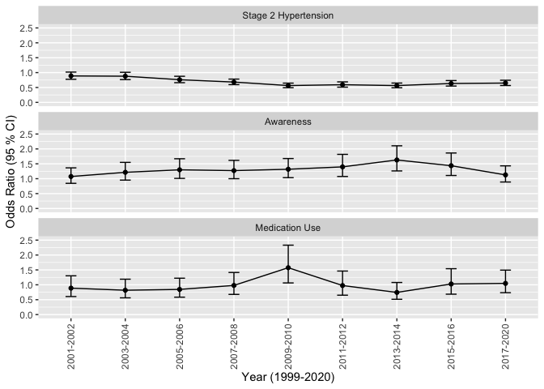
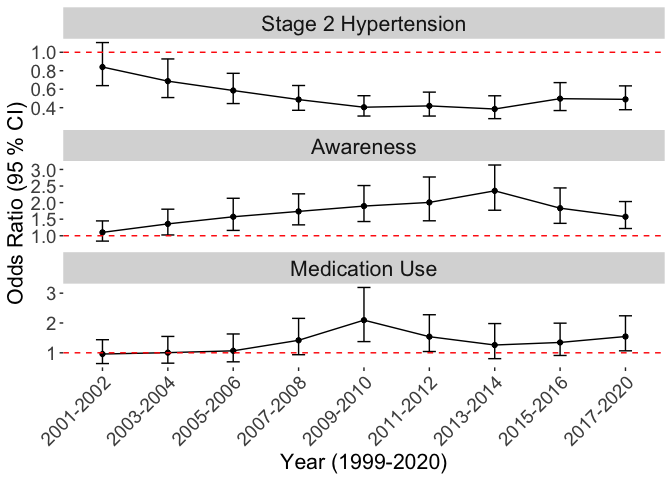

OR Plots for 3 Models
================
2024-01-10

## OR Plots of Uncontrolled Hypertension, Awareness, Medication Use by Year

``` r
res_m1 <- read_csv("./result_files/res3_m1.csv")
```

    ## New names:
    ## Rows: 19 Columns: 5
    ## ── Column specification
    ## ──────────────────────────────────────────────────────── Delimiter: "," chr
    ## (1): coef.names dbl (4): ...1, OR, ci.low, ci.up
    ## ℹ Use `spec()` to retrieve the full column specification for this data. ℹ
    ## Specify the column types or set `show_col_types = FALSE` to quiet this message.
    ## • `` -> `...1`

``` r
res_m2 <- read_csv("./result_files/res3_m2.csv")
```

    ## New names:
    ## Rows: 19 Columns: 5
    ## ── Column specification
    ## ──────────────────────────────────────────────────────── Delimiter: "," chr
    ## (1): coef.names dbl (4): ...1, OR, ci.low, ci.up
    ## ℹ Use `spec()` to retrieve the full column specification for this data. ℹ
    ## Specify the column types or set `show_col_types = FALSE` to quiet this message.
    ## • `` -> `...1`

``` r
res_m3 <- read_csv("./result_files/res3_m3.csv")
```

    ## New names:
    ## Rows: 19 Columns: 5
    ## ── Column specification
    ## ──────────────────────────────────────────────────────── Delimiter: "," chr
    ## (1): coef.names dbl (4): ...1, OR, ci.low, ci.up
    ## ℹ Use `spec()` to retrieve the full column specification for this data. ℹ
    ## Specify the column types or set `show_col_types = FALSE` to quiet this message.
    ## • `` -> `...1`

``` r
# Storing the original names
original_names1 <- names(res_m1)
original_names2 <- names(res_m2)
original_names3 <- names(res_m3)

# Creating a new names vector
new_names1 <- c("", "coef.names", paste0('m1_', original_names1[3:length(original_names1)]))
new_names2 <- c("", "coef.names", paste0('m2_', original_names2[3:length(original_names2)]))
new_names3 <- c("", "coef.names", paste0('m3_', original_names3[3:length(original_names3)]))

# Applying the new names to res_m1
res_m1 <- res_m1 %>%
  setNames(new_names1)

res_m2 <- res_m2 %>%
  setNames(new_names2)

res_m3 <- res_m3 %>%
  setNames(new_names3)

combined_res <- merge(res_m1, res_m2, by = c("", "coef.names"), all = TRUE)
combined_res <- merge(combined_res, res_m3, by = c("coef.names"), all = TRUE) 
combined_res <- combined_res %>% select(-Var.1, -Var.9)


# Reshape the data to a long format suitable for ggplot
long_df <- combined_res %>%
  gather(key, value, -coef.names) %>%
  separate(key, into = c("model", "measure"), sep = "_") %>%
  spread(measure, value) %>%
  slice(31:57) %>%
  mutate(coef.names = sub("^svy_year", "", coef.names))

m_plot <- 
  long_df %>%
  ggplot(aes(x = coef.names, y = OR, ymin = ci.low, ymax = ci.up, group = model)) +
  geom_point() +
  geom_line() +
  geom_errorbar(width = 0.2) +
  ylim(0,2.5) +
  facet_wrap(~ model, scales = "free_y", ncol = 1,
             labeller = labeller(model = c(
               m1 = "Stage 2 Hypertension",
               m2 = "Awareness",
               m3 = "Medication Use"))) +
  theme(axis.text.x = element_text(angle = 90, hjust = 1)) +
  labs(
    # title = "OR (95% CI) of Stage 2 Hypertension, Awareness, and Self-reported Antihypertensive Medication Us", 
       x = "Year (1999-2020)", y = "Odds Ratio (95 % CI)") +
  theme(axis.text.x = element_text(angle = 90, hjust = 0.5, vjust = 0.5, lineheight = 0.8))

m_plot
```

<!-- -->

``` r
ggsave("./result_files/m_plot_v2.png", plot = m_plot, width = 8, height = 12, dpi = 300)
```

here’s a modified plot

``` r
combined_res <- merge(res_m1, res_m2, by = c("", "coef.names"), all = TRUE)
combined_res <- merge(combined_res, res_m3, by = c("coef.names"), all = TRUE) 
combined_res <- combined_res %>% select(-Var.1, -Var.9)

# Reshape the data to a long format suitable for ggplot
long_df <- combined_res %>%
  gather(key, value, -coef.names) %>%
  separate(key, into = c("model", "measure"), sep = "_") %>%
  spread(measure, value) %>%
  slice(31:57) %>%
  mutate(coef.names = sub("^svy_year", "", coef.names))

m_plot <- 
  long_df %>%
  ggplot(aes(x = coef.names, y = OR, ymin = ci.low, ymax = ci.up, group = model)) +
  geom_point() +
  geom_line() +
  geom_errorbar(width = 0.2) +
  geom_hline(yintercept = 1, linetype = "dashed", color = "red") +
  facet_wrap(~ model, scales = "free_y", ncol = 1,
             labeller = labeller(model = c(
               m1 = "Uncontrolled Blood Pressure",
               m2 = "Awareness",
               m3 = "Medication Use"))) +
  theme(axis.text.x = element_text(angle = 45, hjust = 1, size = 14), # Increases x-axis text size
        axis.text.y = element_text(size = 14), # Increases y-axis text size
        axis.title.x = element_text(size = 16), # Increases x-axis title size
        axis.title.y = element_text(size = 16), # Increases y-axis title size
        legend.text = element_text(size = 14), # Increases legend text size
        legend.title = element_text(size = 16), # Increases legend title size
        strip.text = element_text(size = 16), # Increases facet label size
        panel.background = element_rect(fill = "white"),
        plot.background = element_rect(fill = "white", color = NA),
        panel.grid.major = element_blank(),
        panel.grid.minor = element_blank()) +
  labs(x = "Year (1999-2020)", y = "Odds Ratio (95 % CI)")


m_plot
```

<!-- -->

``` r
ggsave("./result_files/m_plot2_v3.png", plot = m_plot, width = 8, height = 6, dpi = 300)
```
